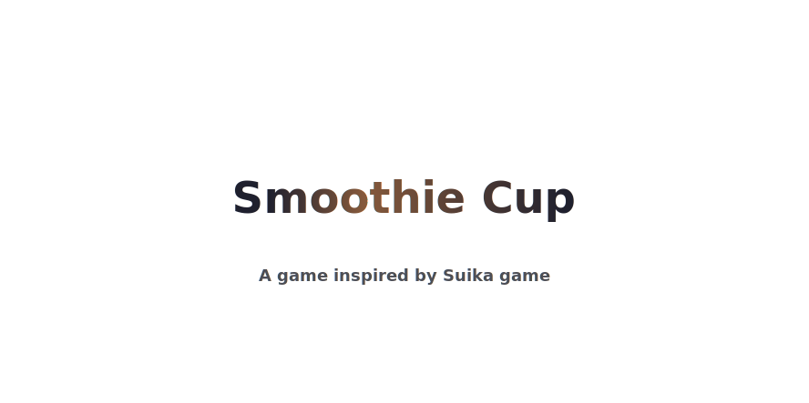
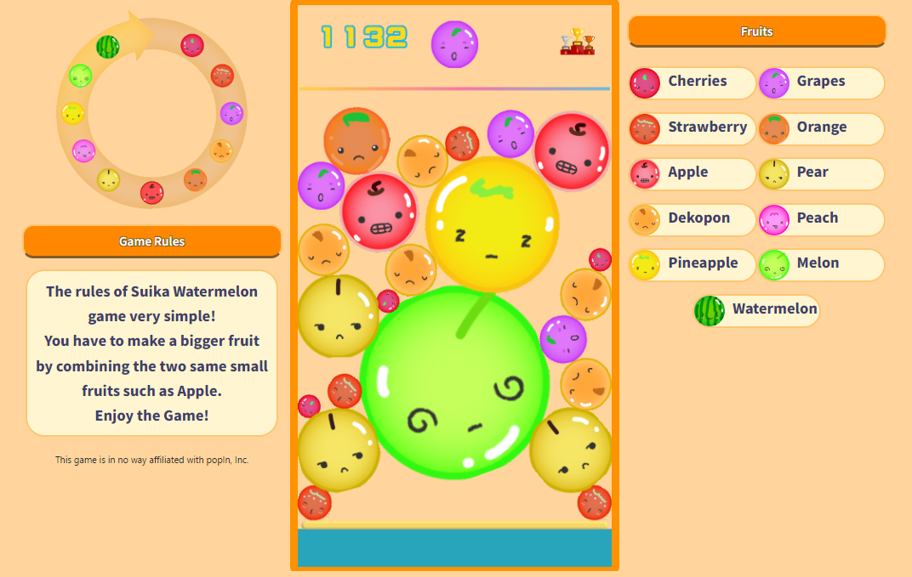
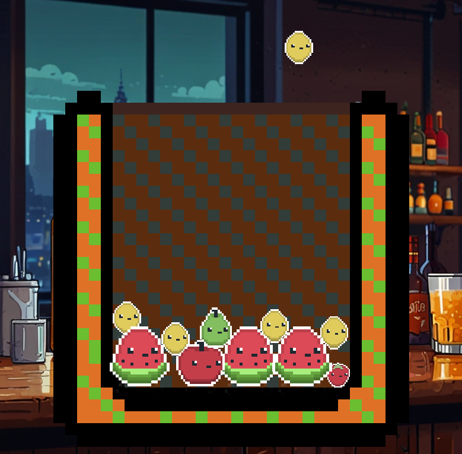

# Smoothie Cup

---

# About Game
This game is a clone of a game called ***Suika Game*** 

The game concept is that you must drop fruits, and if two of the identical fruits hit each other, they will grow into larger fruits, and you must score as many points as possible.

# State of the game
I only created the game logic, so there is still a lot more work to be done.

# ToDo

- [x] game logic
- [ ] change the physics
- [ ] change arts
- [ ] add menu
- [ ] bug fixes

# Others
I know there are some bugs in the game, and I want to fix them, but please try it for yourself and let me know if you encounter any problems. Also, as you can see, I need some help with the art... :)
